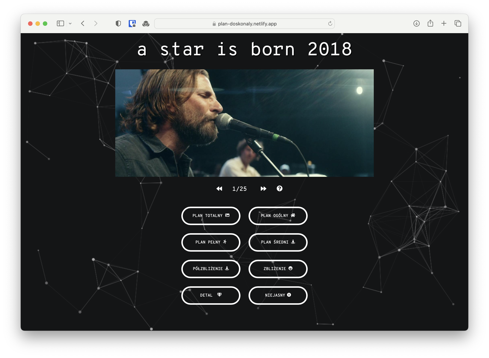
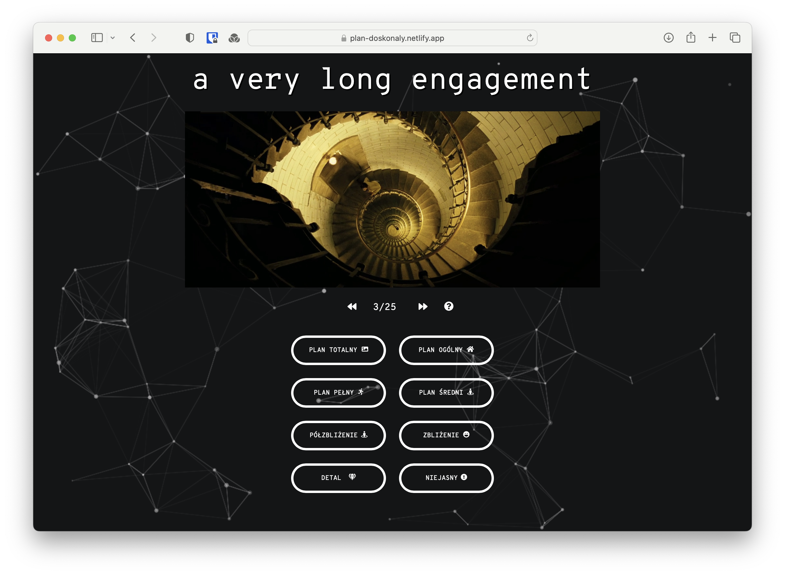
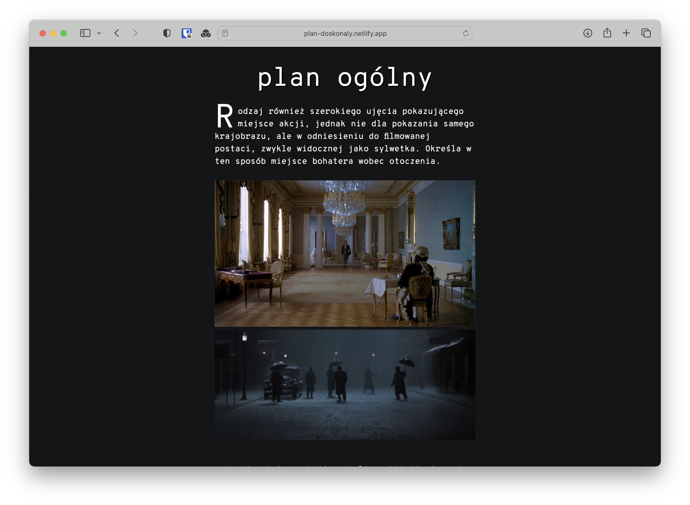
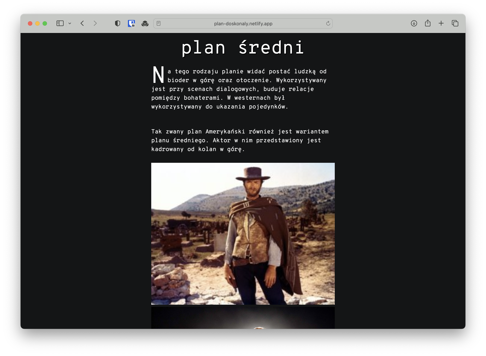
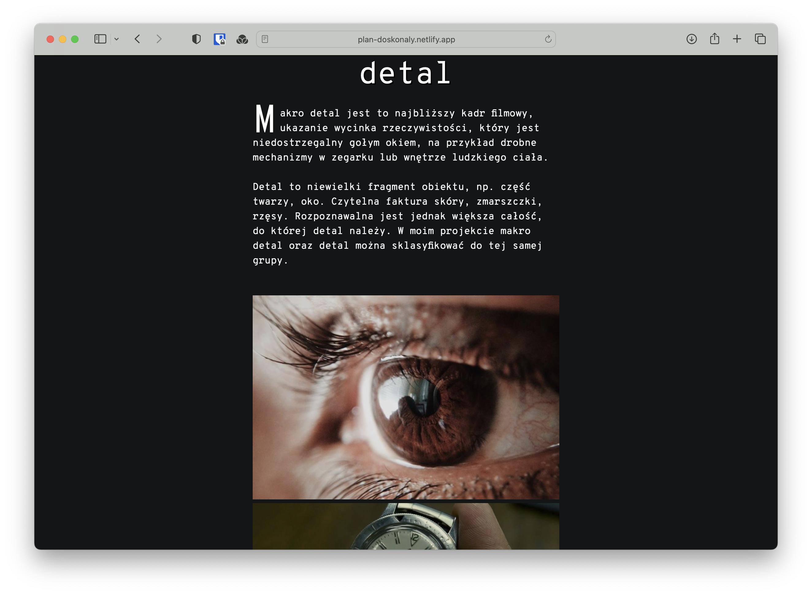

## Movie Set Labelling App (Plan Doskonały)

This is a React Typescript web application for labelling images (shots from movies) as part of an engineering thesis by Szymon Rucinski. The goal of the project is to automate the editing of movies by training an AI model using user input.

    
    
    

How it works
Before you start, please visit the 'start learning' section to familiarize yourself with the types of movie sets/cinematics.

    
    
    

Take the quiz consisting of 25 film frames and identify the correct type of set for each frame.
You will not be able to move on to the next question without submitting your answer.
Once all shots are classified and you agree to publish the results, the answers will be sent to the server.
The project currently has 156 thousand photos from 2504 videos that are waiting to be classified. Your help in correctly identifying the frames is invaluable and will greatly aid in training the AI model. Thank you for your support!
